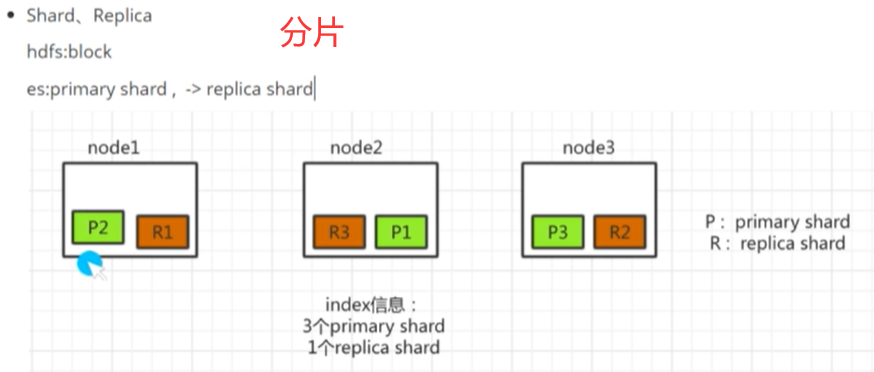

# ElasticSearch

学习网站：https://www.bilibili.com/video/BV18a411p7MG/?spm_id_from=333.788&vd_source=105bfc47eabd25e38628134ce8b51001 

下载网站：elastic.co/guide

应用背景： 使用mysql或hive进行文档搜索时，性能比较差，而elasticSearch是主流的文档搜索数据库。

lucene框架：单进程单节点的文档搜索解决方案

## ELK技术

**Elasicsearch**将多个lucene进行了并行，组成了一个分布式的搜索框架。其提供了搜集、分析、存储数据三大功能，具有分布式、零配置、自动发现、索引自动分片等特点。

优势：海量数据近实时处理、全文&结构化检索、分布式搜索分析

**Logstash**主要用于日志的搜集分析过滤，拿到ES中去

**Kibana**是一个开源工具，为Logstash和elasicsearch提供日志分析友好的Web界面，帮助汇总分析搜索重要数据日志。

## ElasticSearch核心概念

Index(关系型数据库中DataBase):一类文档的集合

Type(关系型数据库中Table)：类型

Document(关系型数据库中Row)：一条记录

**访问:启动bin文件后，访问localhost:9200和localhost:5601**

## ElasticSearch基本操作

打开Management中的Dev Tools，即可写语句

1. 查询集群状态

GET /_cat/health?v

2. 快速查看集群中哪些索引

GET /_cat/indices

3. 创建

PUT /test_index/test_type/1
{
    "name":"test1"
    "address":"hangzhou"
}

4. 查询

GET /test_index/test_type/1

